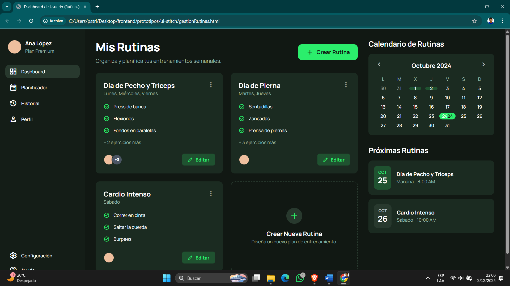
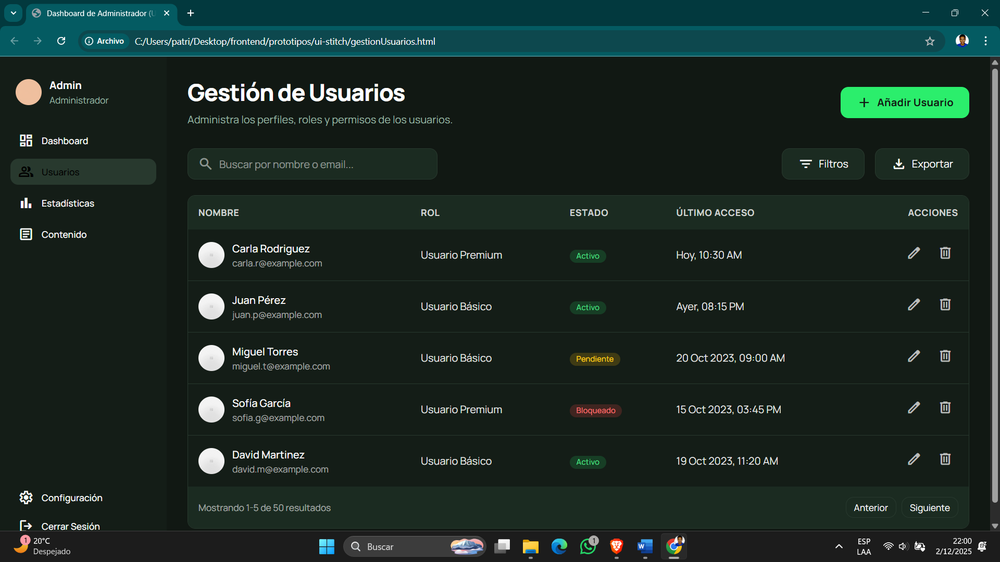
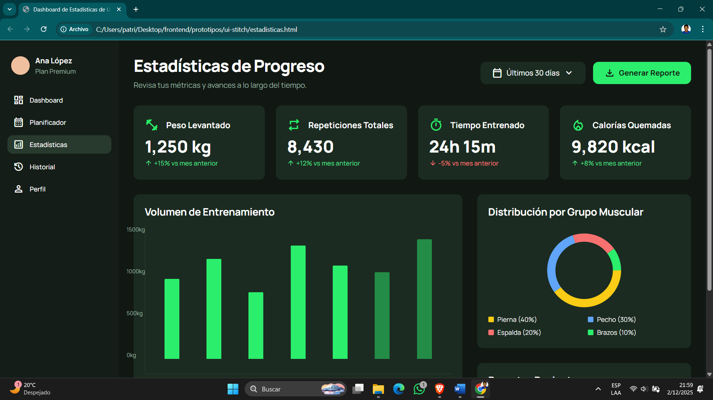
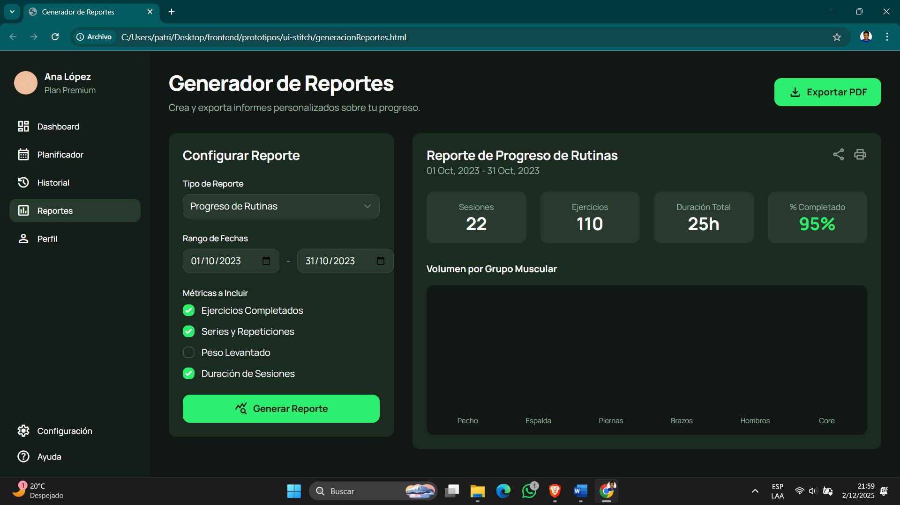
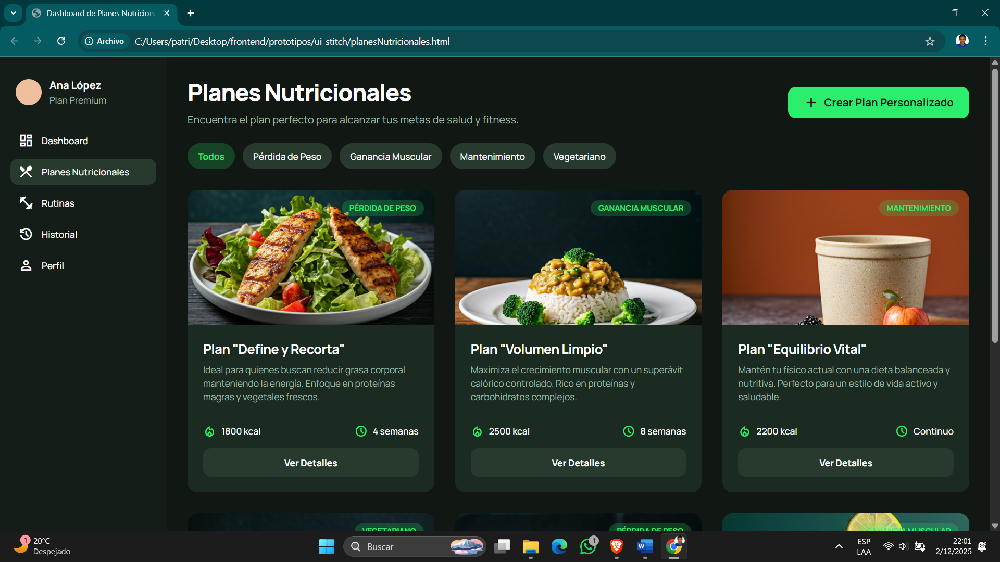
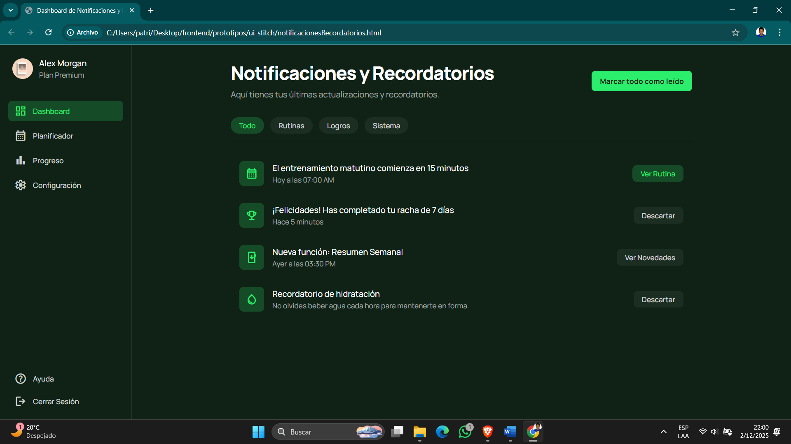

# Prototipo de Interfaces – Sistema FitSIL  
## Documentación de pantallas diseñadas en Stitch (HTML + CSS)

Este documento describe el prototipo de interfaz del sistema **FitSIL**, desarrollado a partir de las pantallas generadas en Stitch y posteriormente implementadas en HTML para el repositorio. El objetivo del prototipo es representar visualmente el flujo de navegación y los componentes principales del sistema de planificación de rutinas.

---

# 1. Flujo general del prototipo

El prototipo está compuesto por **8 pantallas**, organizadas de acuerdo con las principales funcionalidades del sistema FitSIL. El flujo inicia en la pantalla de **Login**, desde donde el usuario puede acceder a funcionalidades de gestión, seguimiento y administración:

1. `login` → ingreso al sistema  
2. `gestionRutinas` → planificación y administración de rutinas  
3. `gestionUsuarios` → administración de perfiles de usuario  
4. `estadisticas` → visualización del progreso e indicadores  
5. `generacionReportes` → exportación de reportes  
6. `planesNutricionales` → consulta de planes alimenticios  
7. `notificacionesRecordatorios` → configuración de alertas  
8. `PrioridadTareas` → organización y prioridad de actividades  

Todas las pantallas comparten estilos unificados, con predominancia de fondo verde, tipografías claras y secciones centradas, manteniendo coherencia visual y fácil navegación.

---

# 2. Documentación Individual de Pantallas

---

## 2.1. **Pantalla: login**
**Archivo:** `login.html`  
**Propósito:**  
Permitir que el usuario acceda al sistema mediante credenciales de inicio de sesión.  
**Componentes principales:**  
- Formulario de usuario y contraseña  
- Botón de inicio de sesión  
- Mensajes de validación  
**Captura de pantalla:**  

---

## 2.2. **Pantalla: gestión de rutinas**  
**Archivo:** `gestionRutinas.html`  
**Propósito:**  
Administrar rutinas de ejercicio, incluyendo creación, edición o eliminación.  
**Componentes principales:**  
- Lista de rutinas  
- Botones de "Agregar", "Editar" y "Eliminar"  
- Tabla o cards con información de ejercicios  
**Captura de pantalla:**  

---

## 2.3. **Pantalla: gestión de usuarios**  
**Archivo:** `gestionUsuarios.html`  
**Propósito:**  
Manejar información de los usuarios registrados en FitSIL.  
**Componentes principales:**  
- Listado de usuarios  
- Botones de gestión (crear, editar, eliminar)  
- Formularios para datos personales  
**Captura de pantalla:**  

---

## 2.4. **Pantalla: estadísticas del progreso**  
**Archivo:** `estadisticas.html`  
**Propósito:**  
Mostrar métricas de rendimiento, progreso físico y resultados semanales/mensuales.  
**Componentes principales:**  
- Gráficos (simulados con contenedores visuales)  
- Indicadores numéricos de progreso  
- Resumen general del historial  
**Captura de pantalla:**  

---

## 2.5. **Pantalla: generación de reportes**  
**Archivo:** `generacionReportes.html`  
**Propósito:**  
Permitir descargar o visualizar reportes del usuario o del progreso físico.  
**Componentes principales:**  
- Selector del tipo de reporte  
- Botón de "Generar reporte"  
- Sección de vista previa  
**Captura de pantalla:**  

---

## 2.6. **Pantalla: planes nutricionales**  
**Archivo:** `planesNutricionales.html`  
**Propósito:**  
Consultar o asignar planes de alimentación vinculados al progreso del usuario.  
**Componentes principales:**  
- Lista de planes nutritivos  
- Sección de recomendaciones  
- Botón para asignar o ver más detalles  
**Captura de pantalla:**  

---

## 2.7. **Pantalla: notificaciones y recordatorios**  
**Archivo:** `notificacionesRecordatorios.html`  
**Propósito:**  
Permitir configurar notificaciones relevantes para el entrenamiento y alimentación.  
**Componentes principales:**  
- Switches o checkboxes para activar tipos de alertas  
- Campos de hora o frecuencia  
- Botón "Guardar cambios"  
**Captura de pantalla:**  

---

## 2.8. **Pantalla: prioridad de tareas**  
**Archivo:** `PrioridadTareas.html`  
**Propósito:**  
Organizar actividades o rutinas según prioridad y permitir reordenar pendientes.  
**Componentes principales:**  
- Lista de tareas con niveles de prioridad  
- Colores y etiquetas indicativas  
- Botones de gestión (completar, eliminar, mover)  
**Captura de pantalla:**  

---

# 3. Conclusiones del prototipo

El prototipo creado en Stitch y llevado a HTML/CSS permite visualizar la estructura funcional del sistema FitSIL, garantizando:

- Coherencia visual y estética uniforme (fondo verde, diseño limpio).  
- Flujo claro entre las ocho pantallas principales.  
- Preparación adecuada para futura implementación en frameworks reales.  
- Facilidad para que el usuario final navegue y entienda cada módulo.  

Este prototipo sirve como base para el desarrollo posterior de la plataforma y para validar la experiencia de usuario antes de implementar la lógica funcional final.

---

# 4. Ubicación de archivos

