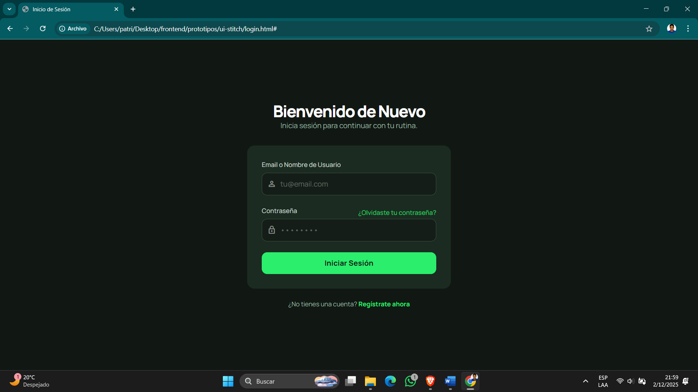
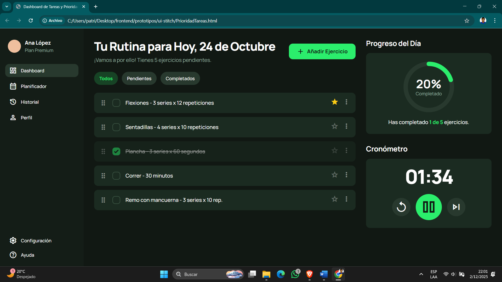

# Prototipo de Interfaz – FitSIL
Sistema de planificación, seguimiento y gestión de rutinas fitness.

Este documento describe el flujo del prototipo diseñado en Stitch y muestra cada una de las pantallas generadas como base visual del sistema FitSIL. Las pantallas corresponden al módulo de rutinas, reportes, usuarios, notificaciones y funcionalidades adicionales.

---

# 1. Flujo General del Prototipo

El prototipo de FitSIL está compuesto por 8 pantallas principales que cubren el flujo básico de un usuario dentro del sistema:

1. **Login** → Acceso al sistema.  
2. **Gestión de Rutinas** → Visualización, creación y edición de rutinas.  
3. **Estadísticas** → Métricas de progreso del usuario.  
4. **Generación de Reportes** → Exportación de informes PDF.  
5. **Gestión de Usuarios** → Administración de cuentas, roles y perfiles.  
6. **Notificaciones y Recordatorios** → Alertas de actividad, rutinas pendientes, avisos diarios.  
7. **Planes Nutricionales** → Vista de dietas asignadas, calorías y macronutrientes.  
8. **Prioridad de Tareas** → Organización de actividades o rutinas con niveles de prioridad.

El flujo sigue la lógica de un sistema fitness completo: el usuario inicia sesión, accede al dashboard, administra rutinas, consulta reportes, recibe recordatorios y puede gestionar aspectos nutricionales.

---

# 2. Pantallas

---

## **1. Pantalla de Login**
**Propósito:**  
Permitir que el usuario acceda al sistema autenticándose con sus credenciales.

**Componentes principales:**
- Formulario (email y contraseña)
- Botón de iniciar sesión
- Enlaces de recuperación de contraseña o registro (si aplica)

**Captura:**

---

## **2. Gestión de Rutinas**
**Propósito:**  
Permitir que el usuario visualice, administre, edite o cree nuevas rutinas semanales.

**Componentes:**
- Tarjetas de rutinas creadas
- Botón “Crear rutina”
- Listas de ejercicios dentro de cada rutina
- Botones de editar o detalles
- Calendario semanal

**Captura:**

---

## **3. Estadísticas**
**Propósito:**  
Mostrar métricas claves del progreso del usuario.

**Componentes principales:**
- Tarjetas de indicadores (peso levantado, repeticiones, calorías)
- Gráficos de barras y anillos
- Botón de descarga de reporte
- Selector de rango de fechas

**Captura:**

---

## **4. Generación de Reportes**
**Propósito:**  
Generar informes personalizados basados en estadísticas y rutinas del usuario.

**Componentes:**
- Selección del tipo de reporte
- Rango de fechas
- Selección de métricas
- Botón Exportar PDF
- Vista previa del reporte generado

**Captura:**

---

## **5. Gestión de Usuarios**
**Propósito:**  
Administrar los usuarios del sistema (solo accesible a roles administrativos).

**Componentes principales:**
- Lista de usuarios
- Opciones para editar, ver o eliminar usuarios
- Información de roles, perfiles y estado de cuenta

**Captura:**

---

## **6. Notificaciones y Recordatorios**
**Propósito:**  
Mostrar recordatorios de rutinas, alertas de progreso, entrenamientos pendientes y avisos.

**Componentes principales:**
- Lista de recordatorios activos
- Indicadores de prioridad
- Iconos de notificación
- Controles para marcar como realizadas o eliminar alertas

**Captura:**

---

## **7. Planes Nutricionales**
**Propósito:**  
Mostrar dietas, planes nutricionales, calorías diarias y macronutrientes asignados al usuario.

**Componentes principales:**
- Tarjetas de alimentos o comidas
- Información de calorías
- Macronutrientes por día
- Menú / semana nutricional

**Captura:**

---

## **8. Prioridad de Tareas**
**Propósito:**  
Organizar actividades o rutinas por prioridad (alta, media, baja).

**Componentes principales:**
- Listado de tareas
- Etiquetas de prioridad
- Controles para reordenar o completar tareas

**Captura:**

---

# ✔ Conclusión
Este prototipo diseñado en Stitch representa la primera versión visual de FitSIL, permitiendo observar los flujos principales del sistema: rutinas, seguimiento del progreso, reportes, nutrición y administración. El diseño funciona como guía para la futura implementación funcional en el proyecto.

