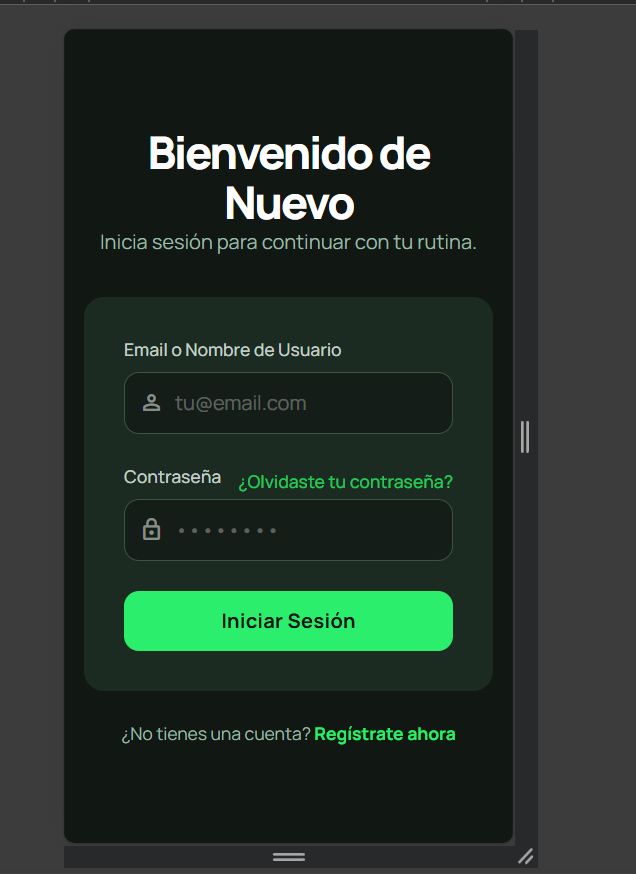
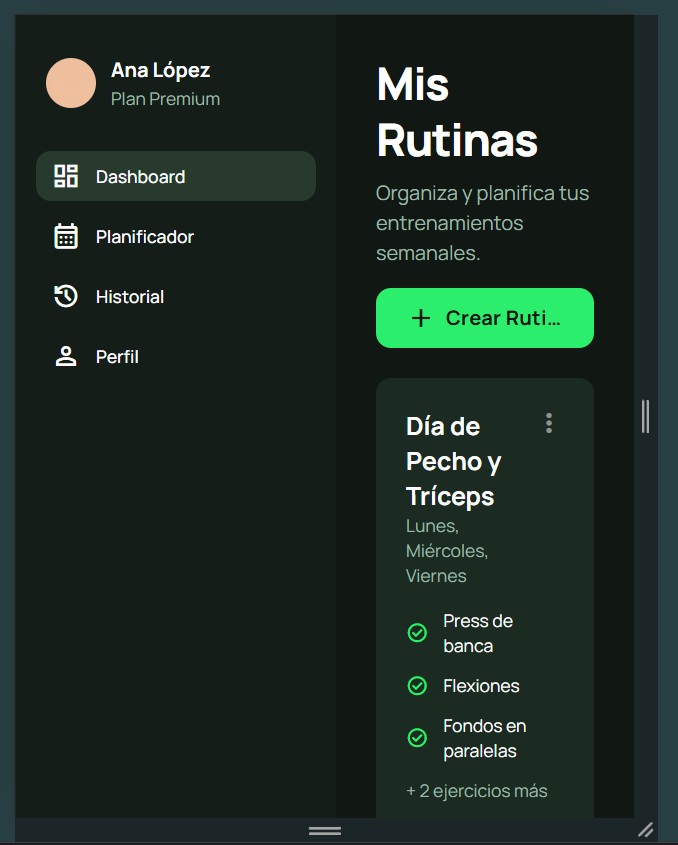
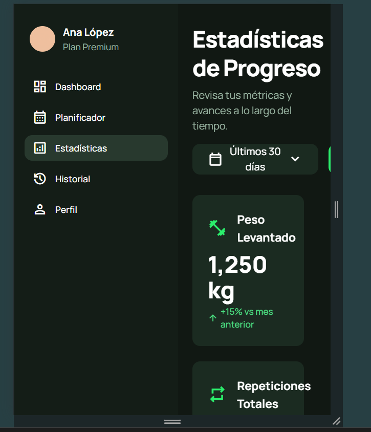
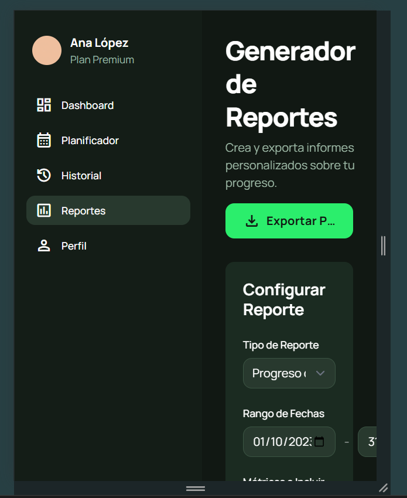
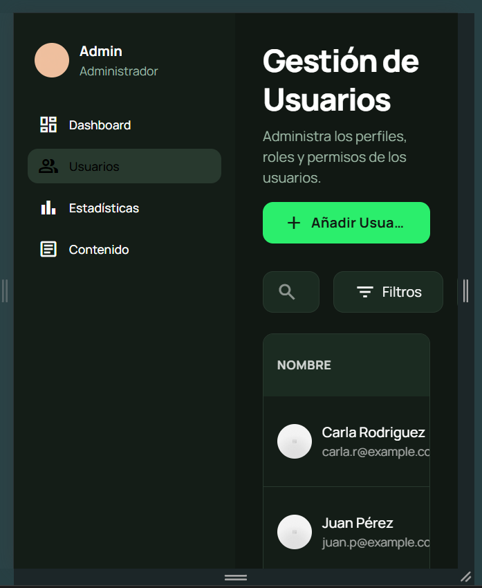
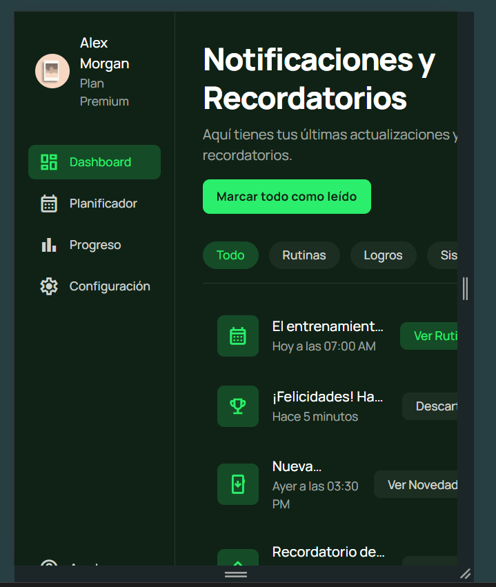
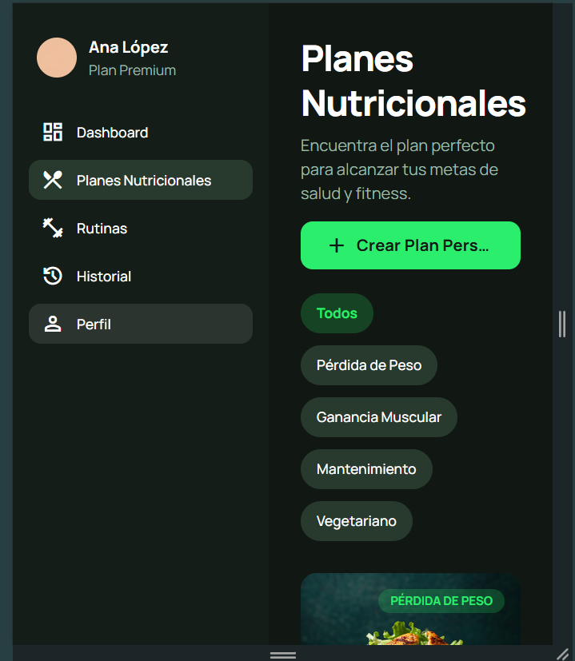
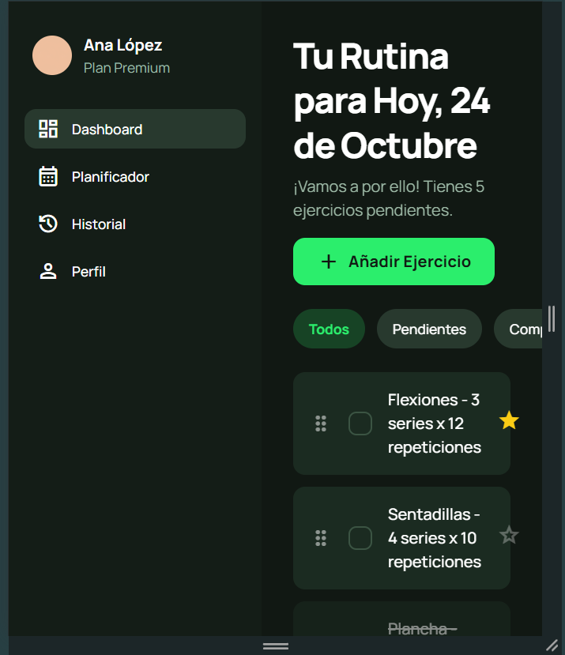

# Prototipo de Interfaz – FitSIL
Sistema de planificación, seguimiento y gestión de rutinas fitness.

Este documento describe el flujo del prototipo diseñado en Stitch y presenta las pantallas desarrolladas para el sistema FitSIL, incluyendo vistas de escritorio y móvil. Estas pantallas representan la base visual de la aplicación y su interacción principal.

---

# 1. Flujo General del Prototipo

El prototipo de FitSIL está compuesto por 8 pantallas principales que representan el flujo completo de un usuario dentro del sistema:

1. **Login**  
2. **Gestión de Rutinas**  
3. **Estadísticas**  
4. **Generación de Reportes**  
5. **Gestión de Usuarios**  
6. **Notificaciones y Recordatorios**  
7. **Planes Nutricionales**  
8. **Prioridad de Tareas**

El flujo inicia con el acceso del usuario, continúa con la gestión de sus rutinas y consulta de estadísticas, y finaliza con herramientas adicionales como nutrición, prioridades y alertas.

---

# 2. Pantallas

---

## **1. Pantalla de Login**

### 📌 Propósito  
Permitir que el usuario acceda al sistema mediante sus credenciales.

### 🧩 Componentes  
- Formulario de correo y contraseña  
- Botón de inicio de sesión  
- Enlaces adicionales (opcional)

### 🖥️ Vista Escritorio  

### 📱 Vista Móvil  

---

## **2. Gestión de Rutinas**

### 📌 Propósito  
Visualizar, crear y administrar rutinas semanales de entrenamiento.

### 🧩 Componentes  
- Tarjetas de rutinas  
- Botones para crear/editar  
- Calendario semanal  
- Listados de ejercicios  

### 🖥️ Vista Escritorio  

### 📱 Vista Móvil  

---

## **3. Estadísticas**

### 📌 Propósito  
Mostrar visualizaciones del progreso del usuario en tiempo real.

### 🧩 Componentes  
- Gráficos de barras y circulares  
- Indicadores de progreso  
- Filtros por fecha  
- Botón para exportar reporte  

### 🖥️ Vista Escritorio  

### 📱 Vista Móvil  

---

## **4. Generación de Reportes**

### 📌 Propósito  
Generar informes personalizados basados en el historial y estadísticas.

### 🧩 Componentes  
- Selector de rango de fechas  
- Lista de métricas para incluir  
- Botón para exportar PDF  
- Vista previa del reporte  

### 🖥️ Vista Escritorio  

### 📱 Vista Móvil  

---

## **5. Gestión de Usuarios**

### 📌 Propósito  
Administrar perfiles, roles y estados de cuenta.

### 🧩 Componentes  
- Tabla de usuarios  
- Botones para ver/editar/eliminar  
- Datos personales y rol del usuario  

### 🖥️ Vista Escritorio  

### 📱 Vista Móvil  

---

## **6. Notificaciones y Recordatorios**

### 📌 Propósito  
Informar al usuario sobre rutinas pendientes, logros o alertas importantes.

### 🧩 Componentes  
- Listado de recordatorios  
- Iconos de alerta  
- Botones para marcar como completado  
- Indicadores de prioridad  

### 🖥️ Vista Escritorio  

### 📱 Vista Móvil  

---

## **7. Planes Nutricionales**

### 📌 Propósito  
Gestionar y visualizar dietas, calorías y macronutrientes asignados al usuario.

### 🧩 Componentes  
- Tarjetas nutricionales  
- Información de calorías y macros  
- Listas de alimentos  
- Organización por días  

### 🖥️ Vista Escritorio  

### 📱 Vista Móvil  

---

## **8. Prioridad de Tareas**

### 📌 Propósito  
Permitir la organización de actividades o rutinas según su importancia.

### 🧩 Componentes  
- Listado de tareas  
- Etiquetas de prioridad (alta, media, baja)  
- Botones para completar o reordenar tareas  

### 🖥️ Vista Escritorio  

### 📱 Vista Móvil  

---

# ✔ Conclusión

El prototipo elaborado en Stitch permite visualizar de forma clara y ordenada la estructura de FitSIL, tanto en su versión de escritorio como móvil. Estas pantallas sirven como guía inicial para el desarrollo funcional del sistema y garantizan una experiencia de usuario coherente, moderna y adaptada a diferentes dispositivos.

